<div align="center">




<br/>

<a href="https://github.com/sumit-kumar-guptaa"></a>
<a href="mailto:sumit.gupta.14486@gmail.com"></a>
<a href="https://www.linkedin.com/in/sumit-kumar-gupta-9b4970285/"></a>


<br/>


</div>

<br/>

## `whoami`

```yaml
name        : Sumit Kumar Gupta
role        : AI/ML Engineer  |  Backend & Distributed Systems
year        : Final-Year B.Tech CSE (7.2 CGPA)
looking_for : AI/ML roles first · SDE roles second
next_move   : M.Tech in AI/ML (BITS Pilani, online) after initial work-ex

focus:
  - Applied ML: forecasting pipelines, model tuning, explainability
  - LLM systems: RAG pipelines, MCP tool-calling, multi-agent orchestration
  - Backend that doesn't fall over: Kafka, Redis, RabbitMQ, circuit breakers

belief: "A model in a notebook is a demo. A model behind an API with monitoring is a product."
```

<br/>

<table width="100%">
<tr>
<td width="50%" valign="top">

### 🧠 AI / ML

<br/>
`LightGBM` `Optuna` `MLflow` `SHAP` `Pandas` `RAG` `MCP` `LLM Agents`

</td>
<td width="50%" valign="top">

### ⚙️ Backend & Systems

<br/>
`Spring Boot` `FastAPI` `Kafka` `RabbitMQ` `Redis` `Resilience4j`

</td>
</tr>
<tr>
<td width="50%" valign="top">

### ☁️ Infra & MLOps

<br/>
`Docker` `GitHub Actions` `Prometheus` `Grafana` `n8n`

</td>
<td width="50%" valign="top">

### 💻 Core

<br/>
`Java` `Python` `JavaScript` `React` `PostgreSQL`

</td>
</tr>
</table>

<br/>

## `ls -la ai-ml-projects/`

<table width="100%">
<tr>
<td width="100%" style="border:1px solid #30363D; border-radius:10px; padding:16px;">

### 📈 Enterprise Intelligent Demand Forecasting Platform
An end-to-end **MLOps forecasting system**, not a one-off notebook — built to show the full pipeline from raw data to a served, monitored prediction.

- **Modeling:** `LightGBM` for forecasting + `Optuna` for hyperparameter tuning
- **Explainability:** `SHAP` for feature-level model interpretation
- **Serving & tracking:** `FastAPI` for inference + `MLflow` for experiment tracking
- **Ops:** `Redis` for caching, `n8n` for workflow orchestration, `Prometheus` + `Grafana` for monitoring, containerized with `Docker` and wired to CI via `GitHub Actions`

`LightGBM` `Optuna` `MLflow` `SHAP` `FastAPI` `Redis` `n8n` `Docker`

**[→ View Repo](https://github.com/sumit-kumar-guptaa)**

</td>
</tr>
</table>

<br/>

## `ls -la backend-systems/`

<table width="100%">
<tr>
<td width="50%" valign="top" style="border:1px solid #30363D; border-radius:10px; padding:16px;">

### 💸 Live Expense Tracker
Flagship distributed-systems project — every transaction is a stream event, not a direct DB write.

- **Kafka** as the event backbone for transactions
- **RabbitMQ** for decoupled async workers (notifications, summaries)
- **Redis** caching for hot balance reads
- **Resilience4j** circuit breakers for fault tolerance
- **Gemini AI** integration, with a RAG + MCP server layer in progress
- Deployed on **AWS**, containerized with **Docker**

`Spring Boot` `Kafka` `RabbitMQ` `Redis` `Resilience4j` `AWS` `Gemini AI`

**[→ View Repo](https://github.com/sumit-kumar-guptaa)**

</td>
<td width="50%" valign="top" style="border:1px solid #30363D; border-radius:10px; padding:16px;">

### 🗂️ TaskFlow (Golki.io)
Multi-module, Jira-inspired task management platform with an AI layer built in as a first-class citizen.

- **RBAC** and **Kafka-driven** notification pipelines
- **WebSocket** real-time board updates
- **AI Help Desk** — separate Spring AI + LLM microservice with RAG and MCP tool-calling
- Full-stack: **Spring Boot + React**, JWT auth, Kanban board with drag-and-drop

`Spring Boot` `React` `Kafka` `WebSocket` `Spring AI` `RAG` `MCP`

**[→ View Repo](https://github.com/sumit-kumar-guptaa)**

</td>
</tr>
<tr>
<td width="50%" valign="top" style="border:1px solid #30363D; border-radius:10px; padding:16px;">

### ⚡ Custom HTTP Server (from scratch)
Built raw HTTP/1.1 parsing, routing, and response building with zero frameworks — then benchmarked it.

- Single-threaded → multi-threaded → **thread pool**, benchmarked against real concurrent load
- **~800K request** benchmark with a JUnit-based load simulation
- The point: understand what Tomcat/Netty already solved, and prove it with numbers

`Core Java` `Concurrency` `Thread Pools` `JUnit`

**[→ View Repo](https://github.com/sumit-kumar-guptaa)**

</td>
<td width="50%" valign="top" style="border:1px solid #30363D; border-radius:10px; padding:16px;">

### 🎬 More on the grid
Smaller builds that round out the stack — worth a browse on the repos tab.

- **Movie Recommendation System** — content-based filtering with dynamic posters
- **Student Performance Predictor** — Flask + Scikit-learn, Linear Regression / Random Forest
- **CrowdIQ** — public transport crowd prediction using an LSTM/XGBoost/ARIMA ensemble

`Flask` `Scikit-learn` `LSTM` `XGBoost` `ARIMA`

**[→ Browse all repos](https://github.com/sumit-kumar-guptaa?tab=repositories)**

</td>
</tr>
</table>

<br/>

## `git log --graph --stat`

<div align="center">


</div>

<br/>

## `./contribution-snake --autoplay`

A snake that literally eats my GitHub contribution graph, regenerated daily.

<div align="center">

</div>

> This one is already wired up — `.github/workflows/snake.yml` is included in this package. After you push, just go to the **Actions** tab of your repo and manually run `generate-snake-animation` once. It creates an `output` branch with the live SVG, and the image above starts working automatically from then on (and refreshes daily).

<br/>

## `systemctl status skills`

```
● AI/ML Model Development (LightGBM, Optuna, SHAP)   [●●●●○] ACTIVE
● LLM / RAG / MCP Integration                        [●●●●○] ACTIVE
● Core Java & JVM Concurrency                        [●●●●●] PRODUCTION-READY
● Spring Boot / Distributed Systems (Kafka/MQ/Redis) [●●●●●] PRODUCTION-READY
● MLOps (MLflow, Docker, CI/CD, Monitoring)          [●●●●○] DEPLOYED
● AWS Cloud Infrastructure                           [●●●●○] DEPLOYED
● DSA (Blind 75 + LC 150)                            [●●●○○] IN PROGRESS
```

<br/>

<div align="center">

```
Open to: AI/ML Engineer roles · Applied ML · Backend SDE · AI-integrated backend
```

*"Most people learn by reading docs. I learn by training the model wrong first, then reading the loss curve."*


</div>
